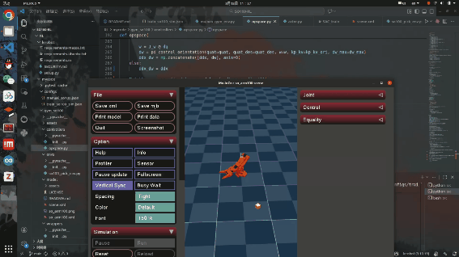

# SO100-RL-VLA

## Overview

SO100-RL-VLA is a project focused on training Visual-Language-Action (VLA) models for robotic arms using reinforcement learning. This project achieves Sim2Real Transfer, allowing models trained in a simulation environment to be directly applied to real robotic systems.This project, based on the Lerobot framework, open-sources the SO100 RL training environment. Training tasks can be modified via src/project/rl/gym_so100, making it highly versatile.

### Sim Train


### Real Test


### Generalization test


## Main Function

- **Reinforcement Learning Training Framework:** Supports multiple RL algorithms (SAC, Diffusion Policy, GROOT, etc.)

- **Simulation Environment:** SO100 robotic arm simulation environment based on Gym and Mujoco

- **Realistic Robot Control:** Supports SO100 robotic arm hardware control

- **Vision Processing:** Integrates camera systems (Realsense, OpenCV) and image processing pipelines

- **Data Acquisition and Processing:** Provides dataset processing, video recording, and conversion tools

- **Model Deployment:** Supports deploying pre-trained models on real robots

- **Mixed Reality Interaction:** Supports human-in-the-Loop (HIL) control between humans and robots

## Environmental installation

### Conda（recommend）

```bash
conda env create -f environment.yml

conda activate so100-rl-vla

pip install -e .
```

## Quick Start

### 1. Configs

- `train_so100_sim.json`：Simulated environment training configuration
- `manual_so100.json`：Real robot manual control configuration

### 2. Train model

```bash
python -m project.rl.gym_manipulator --config_path path/to/manual_so100.json

```

```bash

python -m project.rl.actor --config_path /path/to/train_so100_sim.json

python -m project.rl.learner --config_path /path/to/train_so100_sim.json
```

## Author

- Chengwei Zhang
- QQ: 2017809834
- Email: ZhangCW233666@163.com 

---

## Statement
Due to confidentiality principles, the open-source SO100 robotic arm was used instead.
This project primarily targets open-source training Sim environments.
The model trained in sim can be inserted into the Lerobot inference framework for both sim and real-world testing.

