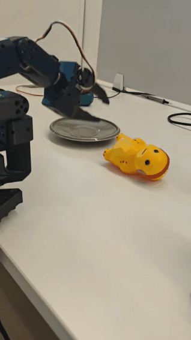

# SO100-RL-VLA

## 项目概述

SO100-RL-VLA 是一个专注于使用强化学习（Reinforcement Learning）训练机械臂 VLA（Visual-Language-Action）模型的项目。该项目实现了模拟到真实世界的迁移（Sim-Real Transfer），允许在模拟环境中训练的模型直接应用于真实机器人系统。

    
## 主要功能

- **强化学习训练框架**：支持多种 RL 算法（SAC、Diffusion Policy、GROOT 等）
- **模拟环境**：基于 Gym 和 Mujoco 的 SO100 机械臂模拟环境
- **真实机器人控制**：支持 SO100 机械臂硬件控制
- **视觉处理**：集成了相机系统（Realsense、OpenCV）和图像处理管道
- **数据采集与处理**：提供数据集处理、视频录制和转换工具
- **模型部署**：支持在真实机器人上部署训练好的模型
- **混合现实交互**：支持人与机器人的混合控制（HIL - Human-in-the-Loop）

## 环境安装

### 使用 Conda（推荐）

```bash
conda env create -f environment.yml

conda activate so100-rl-vla

pip install -e .
```

## 快速开始

### 1. 配置文件

项目使用 Hydra 进行配置管理，主要配置文件位于 `config/` 目录：

- `train_so100_sim.json`：模拟环境训练配置
- `manual_so100.json`：真实机器人手动控制配置

### 2. 训练模型

```bash
python -m project.rl.gym_manipulator --config_path path/to/manual_so100.json

```

```bash

python -m project.rl.actor --config_path /path/to/train_so100_sim.json

python -m project.rl.learner --config_path /path/to/train_so100_sim.json
```

## 联系方式

如有问题或建议，请通过以下方式联系：

- 提交 Issue
- 发送邮件至项目维护者
- 加入项目 Slack 频道

---

